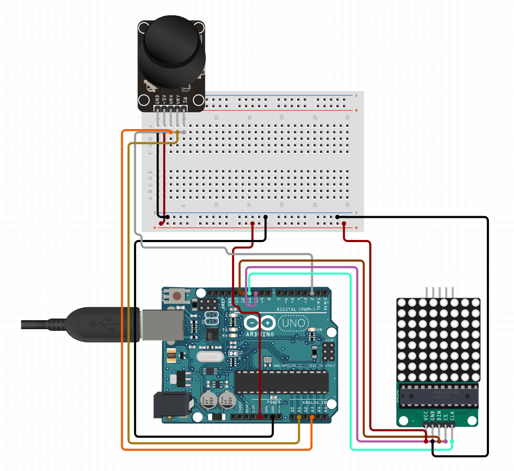

# IDE
I've used Visual studio code with Platform IO.

# Installation guide
* Clone repository
* Install `LedControl` library from package manager
* WireUp circuits like in below screen
* Connect arduino with Your PC
* Upload and play

# Required C++ libraries
* pio lib install "LedControl"

# Circuit overview

